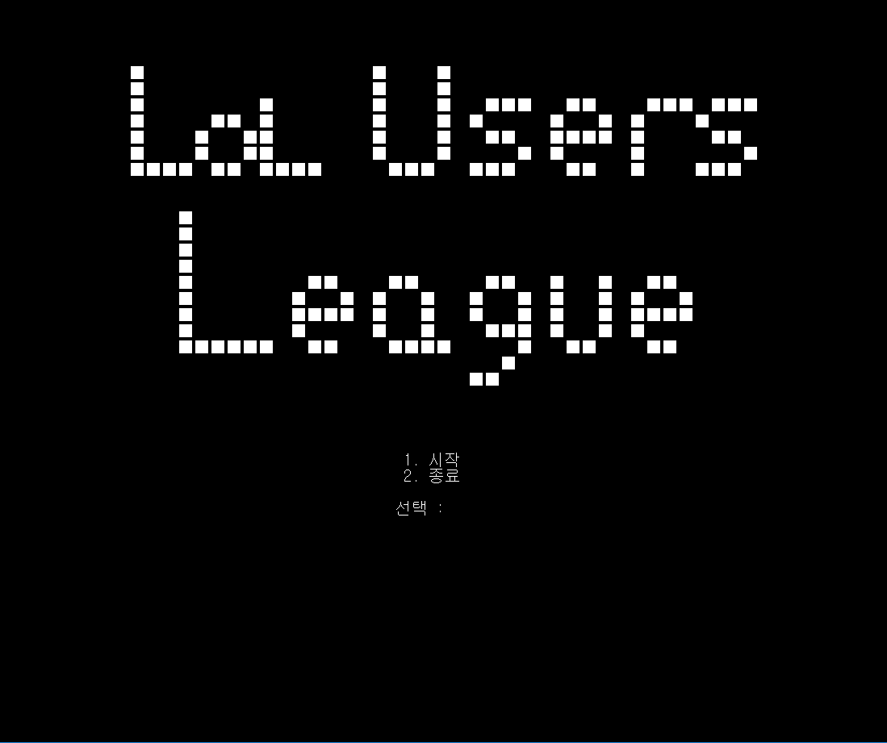
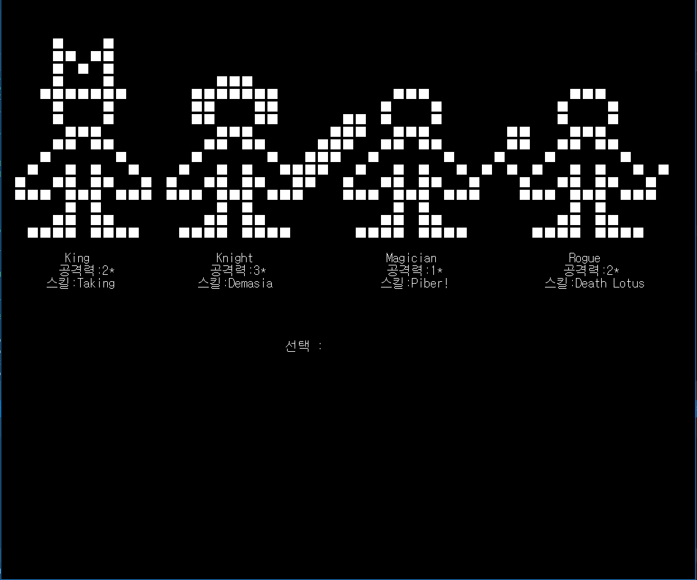
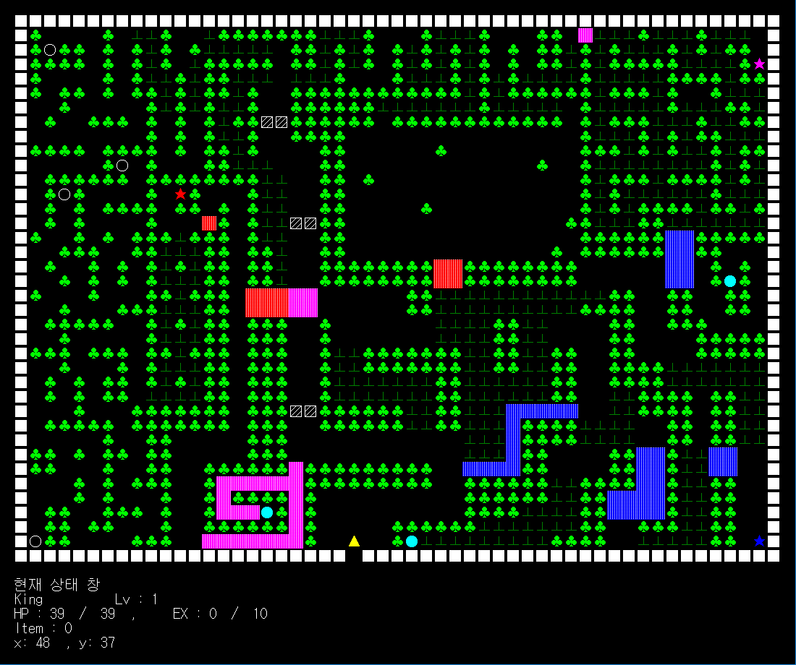
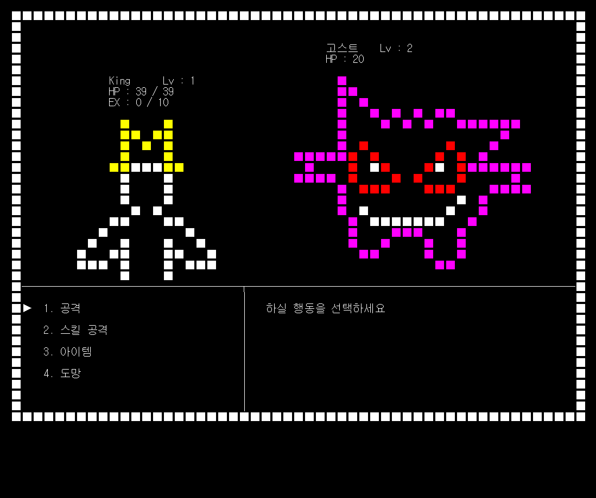

<b>#1. 포켓몬스터</b>  
- 개발인원 : 1명  
- 개발기간 : 2013.11 ~ 2013.12  
- 개발환경 : Windows  
- 개발언어 : C언어  
- 개발툴   : Microsoft Visual Studio 2010  
- 작품소개 : C언어를 이용해서 만든 포켓몬스터 게임  
- 작품내용 : LOL(League of Legends)에 빠진 사람들이 어렸을 때 즐겼던 포켓몬스터 게임에 대한 향수를 불러일으키기 위해서 만들었음.  
- 개발내용
_1.	LOL 유저를 배려한 익숙한 직업 캐릭터 ( 스킬 포함 )  
_2.	한눈에 들어오는 전체 지도  
_3.	잔디밭에서 일정 확률로 나오는 몬스터와의 싸움  
( 일반 공격, 스킬 공격, 아이템, 도망 )  
_4.	보이는 미로와 보이지 않는 미로를 만들어 게임 난이도 증가 (장애물을 만날 때 까지 멈추지 않는 미로, 순간이동 미로, 보통 미로)  
_5.	Boss몹을 만들어 게임 진행에 순서 부여 (보스를 깨면 다음 구역으로 넘어갈 수 있도록 벽이 사라짐)  
_6.	아이템을 획득해서 사용할 수 있는 기능 추가  

Title 화면  
1. 시작  
2. 종료  
 

selectChar 화면  
1. King  
2. Knight  
3. Magician  
4. Rogue  
 

Main_MapViewer 화면  
1. 전체 맵
2. 캐릭터 상태
3. 캐릭터 위치
 

miniGame 화면  
1. 공격  
2. 스킬 공격  
3. 아이템  
4. 도망  
 
+ 몬스터 종류  
1. 이상해씨  
2. 꼬부기  
3. 고스트  
