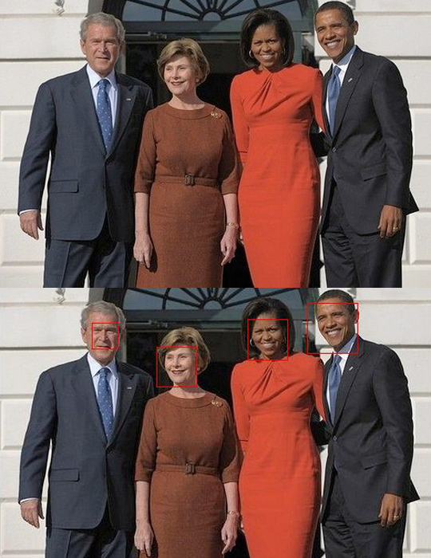

<b>#2. 얼굴검출</b>  
- 개발인원 : 1명  
- 개발기간 : 2014.04 ~ 2014.05  
- 개발환경 : Windows  
- 개발언어 : Matlab  
- 개발툴   : Matlab  
- 작품소개 : Viola Jones가 작성한 논문을 바탕으로 Adaboost를 통한 얼굴 학습 및
얼굴 검출을 구현함.  
- 작품내용 : 수 많은 사람 얼굴 데이터로부터 모델을 학습시키고, 새로운 입력 데이터가 들어왔을 때 얼굴이라고 판단되는 부분에 빨간색 네모 테두리를 그리는 프로그램이다.  
- 개발내용  
_1. Adaboost(Adaptive Boosting) 알고리즘을 돌리기 위한 Integral Image 생성  
_2. Haar-like feature 구하기  
_3. 얼굴 데이터를 사용하여 모델 학습  
_4. 얼굴이라고 판단될 수 있는 후보 중에서 일정 신뢰도 이상을 가지는 영역을 얼굴이라고 판단.  

결과 예시 
