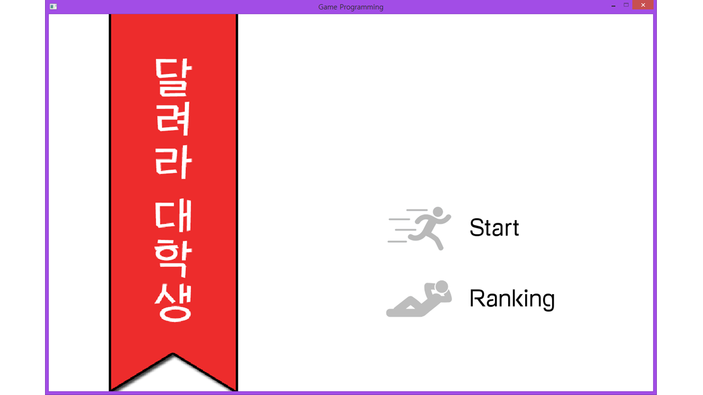

<b>#3. 달려라 대학생</b>  
- 개발인원 : 4명  
- 개발기간 : 2017.05 ~ 2017.06 초  
- 개발환경 : Windows  
- 개발언어 : C++  
- 개발 툴  : Microsoft Visual Studio 2013  
- 작품소개 : 게임을 기획, 제작해보는 프로젝트  
- 작품내용 : 대학생을 주인공으로 두 가지 주어지는 상황(Stage)에 대해서 해결하려고 노력하는 게임  
- 개발내용  
_1. 배경음, 효과음, Stage1 배경을 제외한 모든 리소스 제작  
_2. 2개 Stage, 2개 Notice 및 Intro, Ending, Ranking으로 구성  
_3. 게임을 재도전할 경우 게임 진행방법 화면 표시X  
_4. Ranking 파트 구현  
- 내가 맡은 역할  
_1. 진행 방향 설정  
_2. 게임 아이디어 종합 및 정리  
_3. 각 스테이지별 상세 구현 설정과 필요 리소스 파악  
_4. 구현 및 마감 총괄(팀장)  

